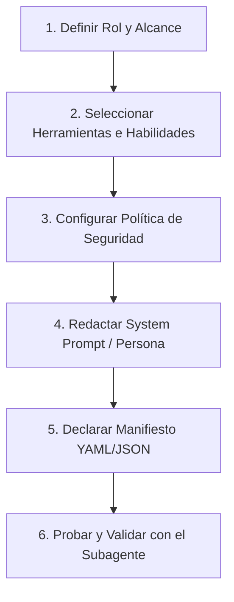

# Custom Agent Builder Skill (Google Antigravity)

Esta habilidad proporciona el flujo de trabajo estándar, las pautas de diseño y los templates para crear **Custom Agents (Agentes Personalizados y Subagentes)** dentro del ecosistema de Google Antigravity (Antigravity 2.0 y Antigravity CLI), basado en los principios oficiales de [Introducing Custom Agents](https://antigravity.google/blog/introducing-custom-agents).

---

## 1. Principios Fundamentales de los Agentes en Antigravity

Los agentes personalizados en Antigravity permiten dividir tareas complejas en subagentes autónomos y especializados con sus propios límites de rol, reduciendo la contaminación de contexto (*context pollution*) y el exceso de herramientas (*tool overload*).

1. **Simetría Real (True Symmetry)**:
   - Un subagente en Antigravity posee la misma potencia arquitectónica que el agente principal: puede ejecutar herramientas de terminal, manipular archivos, controlar navegadores web headless/headed, gestionar tareas en background y mantener su propio scratchpad de razonamiento.
2. **Políticas de Ejecución Acotadas (`commandExecutionPolicy`)**:
   - Cada agente puede operar bajo políticas de seguridad granulares: modo solo lectura, auto-ejecución preaprobada para comandos seguros (pruebas, linter), o requerir confirmación explícita para operaciones destructivas.
3. **Herramientas y Habilidades Asignadas (`tools` & `skills`)**:
   - Se delimita el conjunto de herramientas disponibles para cada rol para evitar alucinaciones y llamadas innecesarias.
4. **Higiene de Contexto**:
   - El subagente trabaja de forma aislada y devuelve únicamente un informe sintético de alta fidelidad al agente principal.

---

## 2. Flujo de Trabajo para Crear un Custom Agent

Cuando se te solicite crear o configurar un nuevo agente, sigue este procedimiento paso a paso:



### Paso 1: Definir el Rol y Caso de Uso
- Determina si el agente es de propósito único (ej. auditor de seguridad, tester de UI en navegador, revisor de código, optimizador de base de datos) o de propósito general.
- Asigna un identificador único en kebab-case (ej. `qa-browser-agent`, `security-auditor`).

### Paso 2: Seleccionar las Herramientas Permitidas
Limita el conjunto de herramientas al mínimo necesario para el rol:
- **Agentes de UI / Navegación**: `open_browser_url`, `browser_get_dom`, `read_browser_page`, `click_browser_pixel`, `capture_browser_screenshot`, `browser_scroll`.
- **Agentes de Análisis / Revisión (Read-Only)**: `view_file`, `grep_search`, `list_dir`, `search_web`. Sin herramientas de escritura ni comandos destructivos.
- **Agentes de Desarrollo Completo**: `view_file`, `write_to_file`, `replace_file_content`, `multi_replace_file_content`, `run_command`, `manage_task`.

### Paso 3: Asignar Habilidades (`skills`)
- Vincula habilidades existentes (declaradas en `.agents/skills/` o `~/.gemini/config/skills/`) que el agente cargará progresivamente según la necesidad de la tarea.

### Paso 4: Redactar el System Prompt / Instrucciones
El prompt del agente debe definir:
- **Identidad y Misión**: Quién es y cuál es su objetivo estricto.
- **Entradas y Formato de Salida**: Qué espera recibir y cómo debe estructurar su informe de finalización.
- **Restricciones y Guardrails**: Lo que explícitamente NO debe hacer (evitar ediciones fuera del alcance, no alterar credenciales, etc.).

### Paso 5: Guardar el Manifiesto del Agente
- Ubicación estándar en el proyecto: `.agents/agents/<agent_name>.yaml` o dentro de un plugin en `.agents/plugins/<plugin_name>/agents/<agent_name>.yaml`.
- Puedes utilizar los templates listados en `templates/`.

### Paso 6: Validación
- Ejecuta el script de validación [scripts/validate_agent.py](./scripts/validate_agent.py) para asegurar que el manifiesto cumple con el esquema requerido.

---

## 3. Estructura de Carpetas en el Proyecto

```text
.agents/
├── agents/                       # Definiciones de Custom Agents (YAML/JSON)
│   ├── qa-browser.yaml
│   └── code-reviewer.yaml
├── skills/                       # Habilidades reutilizables
│   └── custom-agent-builder/     # Esta habilidad
│       ├── SKILL.md
│       ├── references/
│       ├── templates/
│       └── scripts/
├── rules/                        # Reglas contextuales del espacio de trabajo
└── plugins/                      # Bundles empaquetados
```

---

## 4. Referencias y Recursos

- [Arquitectura de Agentes Antigravity](./references/architecture.md): Detalles técnicos de la simetría y ejecución.
- [Especificación de Configuración](./references/configuration-spec.md): Esquema completo de campos y propiedades YAML/JSON.
- [Resumen Oficial del Blog Antigravity](./references/blog-summary.md): Resumen de *Introducing Custom Agents*.
- [Plantillas de Agentes](./templates/): Plantillas listas para usar.
- [Script de Validación](./scripts/validate_agent.py): Validador de sintaxis y políticas.
