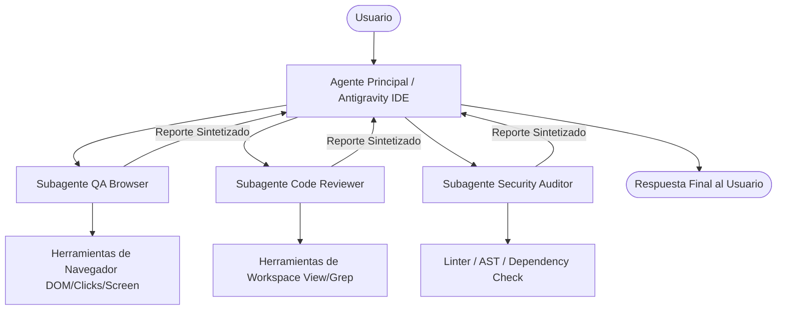

# Arquitectura de Agentes en Google Antigravity

La arquitectura de agentes de Google Antigravity se fundamenta en el desacoplamiento de tareas, la ejecución simétrica y la composición jerárquica de agentes.

---

## 1. El Paradigma de Simetría (True Symmetry)

En la mayoría de los sistemas tradicionales de subagentes, el agente hijo es un "worker" simplificado que solo procesa prompts de texto o tiene acceso a un subconjunto ínfimo de funciones.

Antigravity rompe esta limitación:
- **Misma Maquinaria de Ejecución**: Un subagente se ejecuta sobre el mismo motor de ejecución agentic que el agente principal.
- **Ciclo de Vida Propio**: Posee su propio registro de eventos, historial de pasos, grabación de sesiones de navegador (`.webp`) y artefactos temporales (`scratch/`).
- **Retorno Estructurado**: Al completar su objetivo, el subagente sintetiza sus descubrimientos y emite un informe final que se transfiere limpiamente al agente padre, evitando inyectar cientos de pasos intermedios en la conversación principal.

---

## 2. Jerarquía de Ejecución y Delegación

---

## 3. Manejo de Memoria y Divulgación Progresiva (Progressive Disclosure)

Para no saturar la ventana de tokens del modelo:
- **Descubrimiento Liviano**: Al iniciar, el sistema solo carga el nombre (`name`) y la descripción (`description`) de las habilidades y agentes disponibles.
- **Activación Bajo Demanda**: Cuando el modelo determina que un agente o habilidad es relevante para la solicitud del usuario, solicita el archivo de instrucciones completas (`SKILL.md` o manifiesto de agente).
- **Aislamiento de Errores**: Si un subagente encuentra un fallo (por ejemplo, un timeout de red o una página web que no responde), puede intentar estrategias alternativas sin abortar la sesión principal del usuario.
